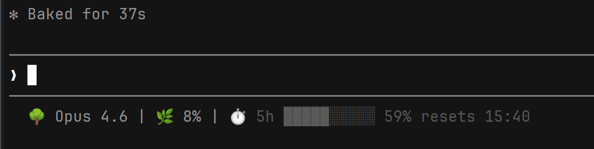

# Claude Code Statusline

A custom statusline script for [Claude Code](https://claude.ai/claude-code) that displays real-time session information in your terminal.



## What It Shows

```
🌳 Opus 4.6 | 🌿 12% | ⏱️ 5h ···ᗧ•••••• 42% resets 14:00
```

or with tokens and block-style bar:
```
🌳 Opus 4.6 | 🌿 10% | 🦥 422 in / 2k out | ⏱️ 5h ████████░░ 89% resets 15:40
```

or with no bar:
```
🌳 Opus 4.6 | 🌿 10% | ⏱️ 5h 42% resets 14:00
```

| Field | Description |
|---|---|
| 🌳 Model | Active Claude model name |
| 🌿 Context | Context window usage percentage |
| 🦥 Tokens | Session token usage (input / output) — optional, see [Options](#options) |
| ⏱️ Rate Limit | 5-hour rate limit usage bar, percentage, and reset time (24h format) |

## Prerequisites

- [Claude Code](https://claude.ai/claude-code) CLI installed
- `python3` — for parsing JSON and formatting output

## Setup

### Step 1. Download the script

Run this command in your terminal to download the script:

```sh
curl -o ~/.claude/statusline.sh \
  https://raw.githubusercontent.com/OleksandrCEO/claude-code-statusline/main/statusline.sh
```

and make it executable:

```sh
chmod +x ~/.claude/statusline.sh
```

### Step 2. Configure Claude Code

Open `~/.claude/settings.json` (create it if it doesn't exist) and add this block:

```json
{
  "statusLine": {
    "type": "command",
    "command": "sh ~/.claude/statusline.sh",
    "padding": 0
  }
}
```

For a **project-level** setup, add the same block to `.claude/settings.json` in your project root.

### Step 3. Start Claude Code

The statusline will appear automatically.

## Options

| Flag | Description |
|---|---|
| `--tokens` | Show session token usage (input / output) |
| `--bar=pacman` | Pacman-style progress bar `···ᗧ••••••` (default) |
| `--bar=blocks` | Block-style progress bar `████░░░░░░` |
| `--bar=none` | No progress bar, only percentage value |

To combine options, add the flags to the command in `settings.json`:

```json
{
  "statusLine": {
    "type": "command",
    "command": "sh ~/.claude/statusline.sh --tokens --bar=blocks",
    "padding": 0
  }
}
```

## Customization

The script reads a JSON object from stdin with the following fields:

| Field | Description |
|---|---|
| `model.display_name` | Name of the active model |
| `context_window.used_percentage` | Context usage as a float |
| `context_window.total_input_tokens` | Total input tokens for the session |
| `context_window.total_output_tokens` | Total output tokens for the session |
| `rate_limits.five_hour.used_percentage` | 5-hour rate limit usage percentage |
| `rate_limits.five_hour.resets_at` | Unix timestamp when 5-hour limit resets |

The rate-limit bar uses color thresholds: gray (<70%), yellow (70–89%), red (>=90%).

Edit `statusline.sh` to change the format, add new fields, or adjust colors.
